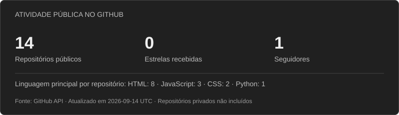

<div align="center">


<samp>building tools that solve real problems</samp>

</div>

<br>

## <samp>~/about-me</samp>

```javascript
const joao = {
  name: "João Barreto",
  based: "Viseu, Portugal 🇵🇹",
  work: "Customer Support @ Gopuff",
  journey: "self-taught — learned to code by building tools for my team",

  building: [
    "Chrome extension automating support workflows (Sprinklr ACW/OQI)",
    "Electron command assistant integrating Slack, Braze and internal APIs",
  ],

  learning: ["advanced JavaScript", "Node.js", "modular architecture"],
  forFun: "Lua scripts for game automation 🎮",
};
```

What started as curiosity became code running in production every day. I build
and maintain internal support tools — and along the way I've picked up hands-on
experience with **bundlers**, **REST API integration**, **reverse engineering
web systems** and **modularizing large codebases**.

## <samp>~/stack</samp>

<p align="left">
  
</p>

## <samp>~/stats</samp>

[](https://github.com/Barretomen?tab=repositories)

<sub>Dados públicos da API do GitHub, atualizados diariamente. Linguagens contabilizadas pela linguagem principal de cada repositório próprio. Atividade e repositórios privados não entram nestes indicadores.</sub>

## <samp>~/contact</samp>

- **Email:** [imjoaobarreto@gmail.com](mailto:imjoaobarreto@gmail.com)
- **LinkedIn:** [linkedin.com/in/barretomendes](https://www.linkedin.com/in/barretomendes/)
- **Instagram:** [@jaobm_](https://www.instagram.com/jaobm_/)
- **Portfólio:** [barretomen.github.io](https://barretomen.github.io/)

<br>

<div align="center">
  <samp>// thanks for stopping by 👋</samp>
</div>
